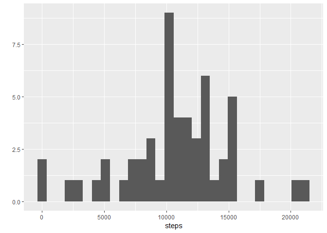

R Markdown
----------

This assignemnt will reproduce the the Activity Tracker data analysis
First load data to a table

    setwd("D:/Rstudio")
    library("data.table")

    ## Warning: package 'data.table' was built under R version 3.5.3

    library(ggplot2)

    ## Warning: package 'ggplot2' was built under R version 3.5.3

    library(dplyr)

    ## Warning: package 'dplyr' was built under R version 3.5.3

    ## 
    ## Attaching package: 'dplyr'

    ## The following objects are masked from 'package:data.table':
    ## 
    ##     between, first, last

    ## The following objects are masked from 'package:stats':
    ## 
    ##     filter, lag

    ## The following objects are masked from 'package:base':
    ## 
    ##     intersect, setdiff, setequal, union

    ## load data from csv file (downloaded and unzipped previously)

    act <- read.csv("data/activity.csv")

    ## view data 

    summary(act)

    ##      steps                date          interval     
    ##  Min.   :  0.00   2012-10-01:  288   Min.   :   0.0  
    ##  1st Qu.:  0.00   2012-10-02:  288   1st Qu.: 588.8  
    ##  Median :  0.00   2012-10-03:  288   Median :1177.5  
    ##  Mean   : 37.38   2012-10-04:  288   Mean   :1177.5  
    ##  3rd Qu.: 12.00   2012-10-05:  288   3rd Qu.:1766.2  
    ##  Max.   :806.00   2012-10-06:  288   Max.   :2355.0  
    ##  NA's   :2304     (Other)   :15840

    head(act)

    ##   steps       date interval
    ## 1    NA 2012-10-01        0
    ## 2    NA 2012-10-01        5
    ## 3    NA 2012-10-01       10
    ## 4    NA 2012-10-01       15
    ## 5    NA 2012-10-01       20
    ## 6    NA 2012-10-01       25

Now remove NA values (missing values) so we can do calculations and
perfrom groupings Find mean total number of steps per day

    act_nona <- na.omit(act)
    act_nona <- na.omit(act)

    act_day <- group_by(act_nona, date)

    act_day <- summarize(act_day, steps=sum(steps))

    summary(act_day)

    ##          date        steps      
    ##  2012-10-02: 1   Min.   :   41  
    ##  2012-10-03: 1   1st Qu.: 8841  
    ##  2012-10-04: 1   Median :10765  
    ##  2012-10-05: 1   Mean   :10766  
    ##  2012-10-06: 1   3rd Qu.:13294  
    ##  2012-10-07: 1   Max.   :21194  
    ##  (Other)   :47

histogram of the number of steps taken each day.

    qplot(steps, data=act_day)

    ## `stat_bin()` using `bins = 30`. Pick better value with `binwidth`.

Calculate the mean and median total number of steps taken per day

    mean(act_day$steps)

    ## [1] 10766.19

    median(act_day$steps)

    ## [1] 10765

What is the AVG DAily Activity Pattern?

    ## create a time series plot of 5 mintute interval (x-axis) and avg number of steps taken per day (y-axis)

    act_int <- group_by(act_nona, interval)
    act_int <- summarize(act_int, steps=mean(steps))

    ggplot(act_int, aes(interval, steps)) + geom_line()

Which 5 minute interval, on average across all days in dataset contains
the maximum number of steps?

    act_int[act_int$steps==max(act_int$steps),]

    ## # A tibble: 1 x 2
    ##   interval steps
    ##      <int> <dbl>
    ## 1      835  206.

Calculate and report total number of missing values in the dataset (rows
with NAs)

    nrow(act)-nrow(act_nona)

    ## [1] 2304

Devise a strategy for filling in all of the missing values in the
dataset replace missing values with mean of steps of that day

    names(act_int)[2] <- "mean.steps"
    act_impute <- merge(act,act_int)

create a new dataset that combines the original dataset with missing
data filled in

    act_impute$steps[is.na(act_impute$steps)] <- act_impute$mean.steps[is.na(act_impute$steps)]

Make a histogram with the total number of steps taken each day and
calcualte and report the mean and median total number of steps taken per
day. Do these values differ from the estimates from the first part of
the assignment? What is the impact of imputing missing data on the
estimates of the total daily number of steps?

    act_day_imp <- group_by(act_impute, date)
    act_day_imp <- summarize(act_day_imp, steps=sum(steps))

    qplot(steps, data=act_day_imp)

    ## `stat_bin()` using `bins = 30`. Pick better value with `binwidth`.

    mean(act_day_imp$steps)

    ## [1] 10766.19

    median(act_day_imp$steps)

    ## [1] 10766.19

The mean appears unchanged, the median is less

Are there any Activity Patterns between Weekdays and weekends?

    ## I have a added a day of week field and classified as weekend or weekday

    act_impute$dayofweek <- weekdays(as.Date(act_impute$date))
    act_impute$weekend <- as.factor(act_impute$dayofweek=="Saturday"|act_impute$dayofweek=="Sunday")
    levels(act_impute$weekend) <- c("Weekday","Weekend")

Make a panel plot containing a time series plot (i.e. type = "l") of the
5-minute interval (x-axis) and the average number of steps taken,
averaged across all weekday days or weekend days (y-axis).

    act_weekday <- act_impute[act_impute$weekend=="Weekday",]
    act_weekend <- act_impute[act_impute$weekend=="Weekend",]

    act_int_weekday <- group_by(act_weekday, interval)
    act_int_weekday <- summarize(act_int_weekday, steps=mean(steps))
    act_int_weekday$weekend <- "Weekday"

    act_int_weekend <- group_by(act_weekend, interval)
    act_int_weekend <- summarize(act_int_weekend, steps=mean(steps))
    act_int_weekend$weekend <- "Weekend"

    act_int <-rbind(act_int_weekday, act_int_weekend)
    act_int$weekend <- as.factor(act_int$weekend)
    ggplot(act_int, aes(interval, steps)) + geom_line() + facet_grid(weekend ~ .)

